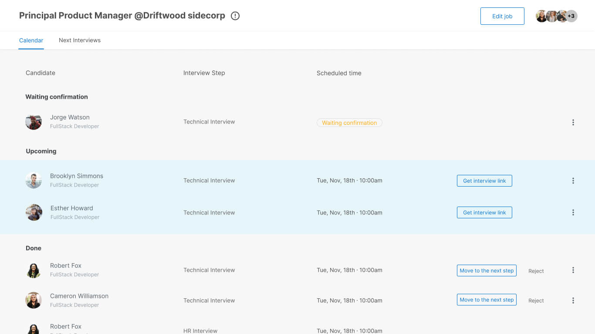

# Calendar Job Interviews
ATTENTION: Table component is temporary, it must be refactored.
# Indice

- [Sobre](#-sobre)
- [Screenshots](#-sobre)
- [Tecnologias Utilizadas](#-tecnologias-utilizadas)
- [To do](#todo)
- [References](#references)

## 🔖 Sobre

Teste pático.

## 📷 Screenshots

<h1>
    
</h1>

## 🚀 Tecnologias utilizadas

Este projeto foi desenvolvido com as seguintes tecnologias:

- [React](https://pt-br.reactjs.org/)
- [Styled Components](https://styled-components.com/)

## Todo

- [ ] **ATTENTION**: Table component is temporary, it must be refactored.
- [ ] Component Face Pile: add tooltip to show thumbnail name and hidden list names.
- [ ] Component Badge: improve types and variants. Add click action.

## References

- FacePile
    - [react-native-face-pile](https://github.com/peterpme/react-native-face-pile#readme)
- NavTab
    - [react-tabs-redux](https://github.com/patrik-piskay/react-tabs-redux)
    - [react-bootstrap tabs](https://react-bootstrap.github.io/components/tabs/)

---

<h4 align="center">
    Feito com ❤️ by <a href="https://github.com/axeldouglas" target="_blank">Axel Douglas</a>
</h4>